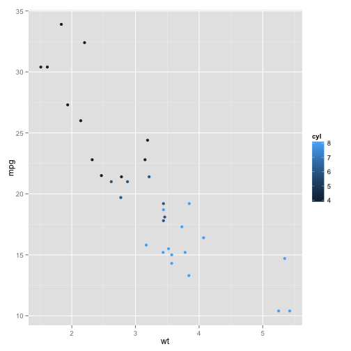
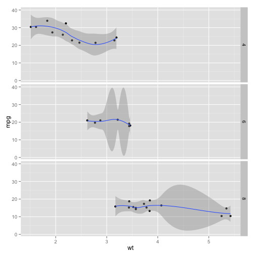

mtcars data set explorer
========================================================
author: Mengyu Zhou
date: 2014-11-26

Explorer with matcars Data Set
========================================================

The **`mtcars`** data was extracted from the 1974 _Motor Trend_ US magazine, and comprises fuel consumption and 10 aspects of automobile design and performance for 32 automobiles (1973–74 models).

I build **[a simple shiny application](http://zmoony.shinyapps.io/mtcars)** which plot relationships between variables in the data set. Available variables are:

```r
names(mtcars)
```

```
 [1] "mpg"  "cyl"  "disp" "hp"   "drat" "wt"   "qsec" "vs"   "am"   "gear"
[11] "carb"
```

Variable Meanings
========================================================
| Index | Name | Meaning  |
| :---: | ---- | :------- |
| 1     | mpg  | Miles/(US) gallon |
| 2     | cyl  | Number of cylinders |
| 3     | disp | Displacement (cu.in.) |
| 4     | hp   | Gross horsepower |
| 5     | drat | Rear axle ratio |
| 6     | wt   | Weight (lb/1000) |
| 7     | qsec | 1/4 mile time |
| 8     | vs   | V/S |
| 9     | am   | Transmission (0 = automatic, 1 = manual) |
| 10    | gear | Number of forward gears |
| 11    | carb | Number of carburetors |

Basic Plotting
========================================================
In the application you can choose `X` and `Y` variables to plot. Color points with respect to a variable is also supported:

 

Advance Plotting
========================================================
The application also allows you to apply jitter or smooth goem to get a better sense of data. Facets in rows and columns are also supported:

 
